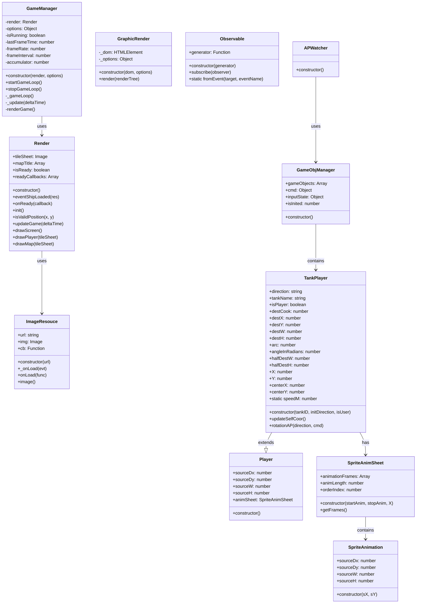
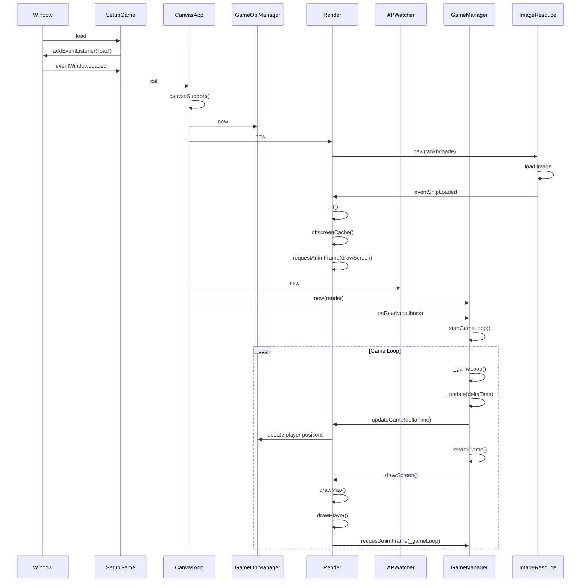
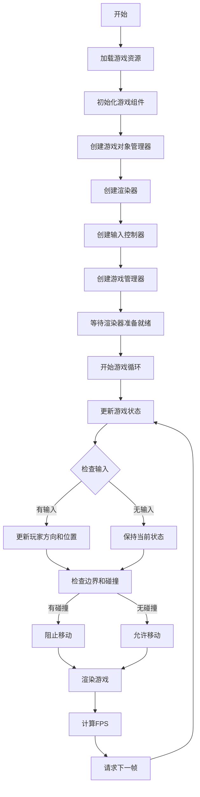

JSTankGame
==========

## 为什么要重新开始写这个项目？
因为，我就是想要重启`自制小游戏`😂。

## Done
- [x] 构建工具升级
- [x] 去除tilemap的细线
- [x] 引入rx替换vanllia event
- [x] 边界检查和障碍物碰撞检测
- [x] tank速度太快了减慢
- [x] ES6改造
    - [x] es6模块化
    - [x] 基于生成器的原生rx系统
    - [x] 基于promise的资源加载

## Todo
- [ ] 基于Reactive和Tree-Rendering的优化渲染机制
    - [ ] 基于Tree-Rendering的精灵渲染
    - [ ] 增加渲染树
    - [ ] 增加diff-rendering
    - [ ] dirty-check
    - [ ] 从dirty-check到passive-depency-graph

## 游戏架构

### 类图

### 序列图

### 活动图

